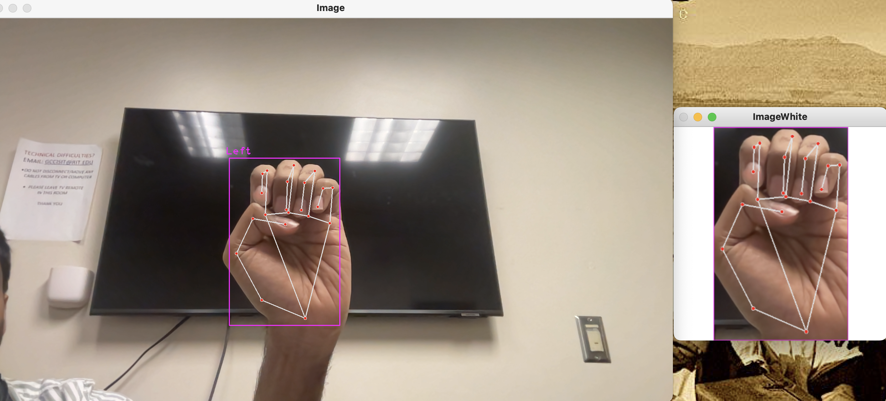
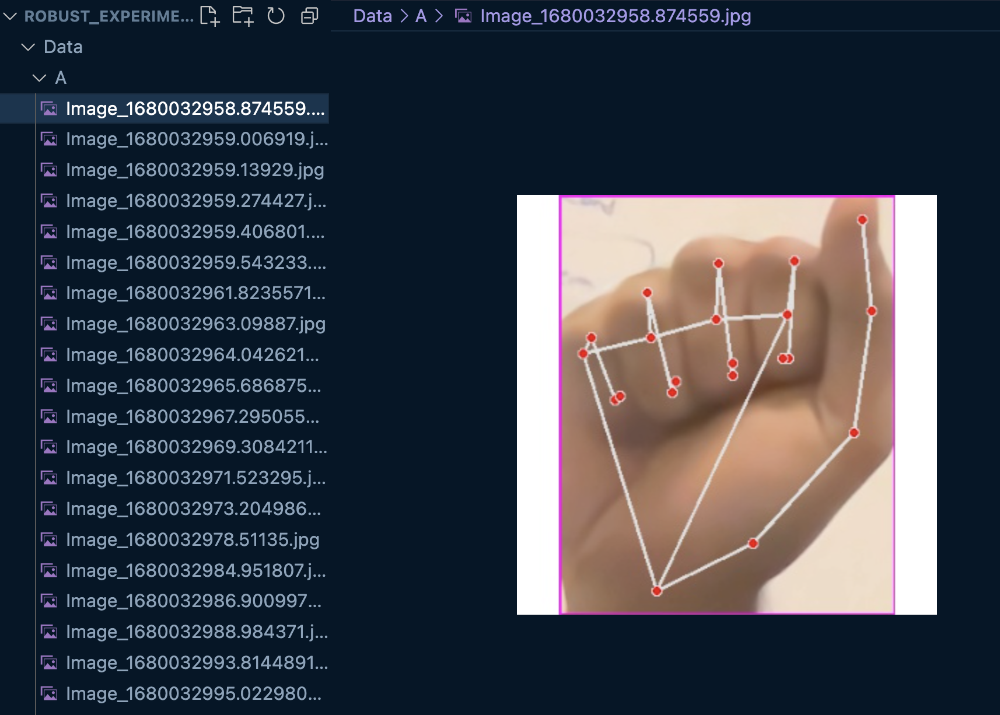

This code helps you use the camera to box hands, mark joints, corp and save images for Training

procedure to create a conda environemnt:

`conda env create -f environment_hand_data_capture.yml`
`conda activate hand_capture`

How to run the code:

1.  In the create_data.py change the `folder = "Data/<capture symbol character>"` to the Character for which you are intending to capture images. (choose characters where there is no data in the Data folder)
    NOTE: create a folder for the alphabet in the path specified above before proceeding to next step

2.  save and Run `python create_data.py` through terminal.

3.  You must see your video stream from camers pop up.

4.  point the sign (as per the currentcapture character) to the camera and you can see the hand boxed and marked.
    

5.  once ready press `s` on keyboard to save the hand corped and marked to folder. repeat this to capture multiple images with different hand orientations and backgrounds, try to swith hands left/right.
    

6.  once you capture around 35 images. repeat from step 1 to 6 to capture a different character.

this code is just to capture around 35 images of marked hands for each character, this data will be used to train a model. and only the final model will be deployed in ML service.
